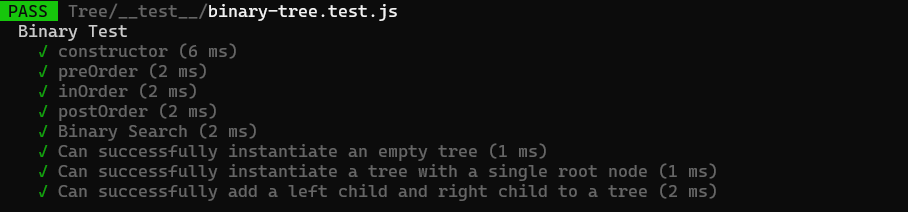

# Trees

* Common Terminology:

1. Node - A Tree node is a component which may contain its own values, and references to other nodes
2. Root - The root is the node at the beginning of the tree
3. K - A number that specifies the maximum number of children any node may have in a k-ary tree. In a binary tree, k = 2.
4. Left - A reference to one child node, in a binary tree
5. Right - A reference to the other child node, in a binary tree
6. Edge - The edge in a tree is the link between a parent and child node
7. Leaf - A leaf is a node that does not have any children
8. Height - The height of a tree is the number of edges from the root to the furthest leaf

* Task:

 * Binary Tree
 - Create a Binary Tree class
 - Define a method for each of the depth first traversals:
1. pre order
2. in order
3. post order which returns an array of the values, ordered appropriately.

 * Binary Search Tree
 - Create a Binary Search Tree class
 - This class should be a sub-class (or your languages equivalent) of the Binary Tree Class, with the following additional methods:
1. Add
 - Arguments: value
 - Return: nothing
 - Adds a new node with that value in the correct location in the binary search tree.
2. Contains
 - Argument: value
 - Returns: boolean indicating whether or not the value is in the tree at least on

* BIG O:
 - The Big O for the Binary Tree is O(n).
 - The Big O for the Binary Tree Search is O(h).

 