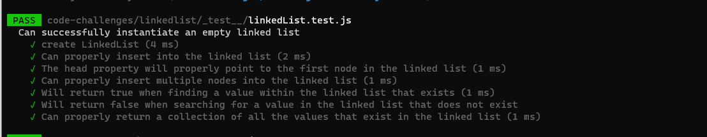

# Linked-List

- It is a sequence of Nodes that are connected to each other. 

- in this challenge how to know the length for it, how to add new node and print it and how to speacfic it to string.
- Adds a new node with that value to the head of the list with an O(1).

* Testing:
1. Can successfully instantiate an empty linked list
2. Can properly insert into the linked list
3. The head property will properly point to the first node in the linked list
4. Can properly insert multiple nodes into the linked list
5. Will return true when finding a value within the linked list that exists
6. Will return false when searching for a value in the linked list that does not exist
7. Can properly return a collection of all the values that exist in the linked list

# Big O:
* Big O for all sections (insert section, include section, string section) 
Size => O(1)
Time => O(n)

