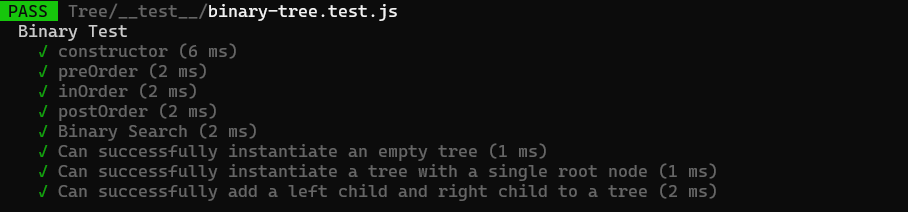

# Hashtables
* Hash - A hash is the result of some algorithm taking an incoming string and converting it into a value that could be used for either security or some other purpose. In the case of a hashtable, it is used to determine the index of the array.
* Buckets - A bucket is what is contained in each index of the array of the hashtable. Each index is a bucket. An index could potentially contain multiple key/value pairs if a collision occurs.
* Collisions - A collision is what happens when more than one key gets hashed to the same location of the hashtable.

* Approach & Efficiency
* I used hashtable with linkedList

- The big O 
- Time=> O(1) .
- Space => O(n).

* Features
- Implement a Hashtable Class with the following methods:

1. set()
- Arguments: key, value
- Returns: nothing
- This method should hash the key, and set the key and value pair in the table, handling collisions as needed.
- Should a given key already exist, replace its value from the value argument given to this method.

2. get()
- Arguments: key
- Returns: Value associated with that key in the table

3. contains()
- Arguments: key
- Returns: Boolean, indicating if the key exists in the table already.

4. keys()
- Returns: Collection of keys

5. hash()
- Arguments: key
- Returns: Index in the collection for that key

* Test:
