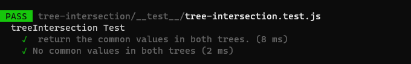

## Tree-intersection

* Feature Tasks
1. Write a function called tree_intersection that takes two binary trees as parameters.
2. Using your Hashmap implementation as a part of your algorithm, return a set of values found in both trees.

* BigO
time: O(n)
space: O(n)